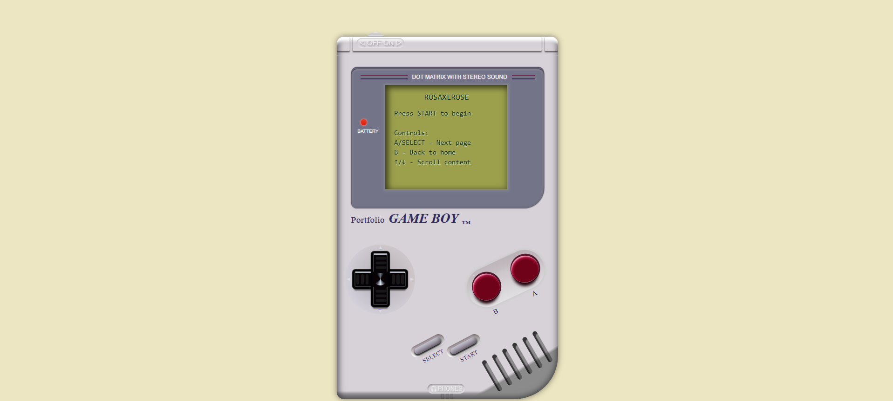

# Game Boy Portfolio

A retro-styled portfolio website built to look and feel like the classic Nintendo Game Boy. Built with Web Components and vanilla JavaScript.

 [Live Demo](https://username.github.io/Game-boy-portfolio)



## Features

- Authentic Game Boy design and interactions
- Responsive and interactive UI
- Built with Web Components
- No external dependencies
- Cross-browser compatible

## Deployment

### GitHub Pages

1. Push your code to GitHub:
```bash
# Initialize git repository (if not already done)
git init

# Add all files
git add .

# Commit changes
git commit -m "Initial commit"

# Add remote repository
git remote add origin https://github.com/YOUR_USERNAME/Game-boy-portfolio.git

# Push to GitHub
git push -u origin main
```

2. Enable GitHub Pages:
   - Go to your repository settings
   - Scroll down to "GitHub Pages" section
   - Select "main" branch as source
   - Click Save
   - Your site will be published at `https://YOUR_USERNAME.github.io/Game-boy-portfolio`

## Getting Started

### Prerequisites

- Node.js (version 14 or higher)
- npm (comes with Node.js)

### Fork the Repository

1. Visit the repository at `https://github.com/Rosaxlrose/Game-boy-portfolio`
2. Click the "Fork" button in the top-right corner
3. Select your GitHub account as the destination
4. Wait for the forking process to complete

### Clone Your Fork

```bash
# Clone the repository
git clone https://github.com/Rosaxlrose/Game-boy-portfolio.git

# Navigate to the project directory
cd Game-boy-portfolio

# Install dependencies
npm install

# Start the development server
npm start
```

### Running Locally

The project will be available at `http://localhost:3000`

## Project Structure

```
Game-boy-portfolio/
├── src/
│   ├── components/         # Web Components
│   │   ├── GameboyButton.js
│   │   ├── GameboyCross.js
│   │   ├── GameboyScreen.js
│   │   └── ...
│   ├── fonts/             # Custom fonts
│   ├── index.html         # Entry point
│   └── index.css          # Global styles
├── package.json
└── README.md
```

## Controls

- **START** - Begin the portfolio presentation
- **A/SELECT** - Navigate to next page
- **B** - Return to welcome screen
- **↑/↓** - Scroll content

## Customization

1. Edit content in `GameboyScreen.js`:
   - Modify the `pages` object to update content
   - Customize styles in the `styles` section

2. Update personal information:
   - Replace placeholder text in the About section
   - Update contact information
   - Add your own projects

## Contributing

1. Fork the repository
2. Create your feature branch (`git checkout -b feature/AmazingFeature`)
3. Commit your changes (`git commit -m 'Add some AmazingFeature'`)
4. Push to the branch (`git push origin feature/AmazingFeature`)
5. Open a Pull Request

## Acknowledgments

- Inspired by the classic Nintendo Game Boy
- RetroGaming font for authentic Game Boy text
- Special thanks to the Web Components community
